# All In Podcast App

The All In Podcast App is a modular Python powerhouse that spins up new podcast episodes inspired by the ["All-In" podcast](https://feeds.megaphone.fm/all-in). Using AI magic, it fetches the latest episode, transcribes it with [Whisper.cpp](https://github.com/ggerganov/whisper.cpp), extracts key insights with [spaCy](https://spacy.io/), crafts witty scripts with [GPT-Neo](https://huggingface.co/EleutherAI/gpt-neo-1.3B), clones voices of hosts like Adam Curry and John C. Dvorak with [Coqui TTS](https://coqui.ai/docs/), generates vibrant show art via [Stable Diffusion](https://huggingface.co/CompVis/stable-diffusion-v1-4), and packages everything into an RSS feed. Perfect for AI enthusiasts, developers, and podcast fans, this app showcases cutting-edge automation and content creation.

## About

Authored by Ian Trimble ([GitHub](https://github.com/itrimble)), this app leverages the ["All-In" podcast](https://feeds.megaphone.fm/all-in) to create engaging, AI-generated episodes. It transcribes episodes, extracts key lessons using [spaCy](https://spacy.io/) and [pytextrank](https://github.com/DerwenAI/pytextrank), generates witty scripts with [GPT-Neo](https://huggingface.co/EleutherAI/gpt-neo-1.3B), clones voices with [Coqui TTS](https://coqui.ai/docs/), and designs vibrant show art with [Stable Diffusion](https://huggingface.co/CompVis/stable-diffusion-v1-4). The modular design ensures each component (e.g., transcription, script generation) is isolated for easy maintenance and extension. Whether you’re a developer, AI enthusiast, or podcast fan, this app offers a deep dive into automated content creation.

## Features

- **Episode Fetching**: Grabs the latest ["All-In" episode](https://feeds.megaphone.fm/all-in) via RSS using [feedparser](https://github.com/kurtmckee/feedparser).
- **Audio Processing**: Converts audio to WAV with [pydub](https://github.com/jiaaro/pydub).
- **Transcription**: Delivers high-accuracy transcription with [Whisper.cpp](https://github.com/ggerganov/whisper.cpp).
- **Lesson Extraction**: Pulls insights and keywords using [spaCy](https://spacy.io/) and [pytextrank](https://github.com/DerwenAI/pytextrank).
- **Context Building**: Links to past lessons with [sentence-transformers](https://www.sbert.net/) and [FAISS](https://github.com/facebookresearch/faiss).
- **Script Generation**: Creates scripts and titles in the style of Adam Curry and John C. Dvorak using [GPT-Neo](https://huggingface.co/EleutherAI/gpt-neo-1.3B).
- **Voice Cloning**: Synthesizes audio with [Coqui TTS](https://coqui.ai/docs/) using reference clips.
- **Show Art**: Designs podcast cover art with [Stable Diffusion](https://huggingface.co/CompVis/stable-diffusion-v1-4).
- **Show Notes**: Summarizes scripts with [BART](https://huggingface.co/facebook/bart-large-cnn).
- **RSS Feed**: Publishes episodes with [feedgen](https://github.com/lkiesow/python-feedgen).

## Architecture

The diagram below illustrates the end-to-end workflow of the All In Podcast App, from fetching an episode to producing an RSS feed. Each step maps to a specific module, showcasing the app’s modular design.

```mermaid
flowchart TD
    A[Start] --> B[RSS Feed Fetching\nrss_feed.py\nfeedparser]
    B --> C[Audio Processing\naudio_processing.py\npydub]
    C --> D[Transcription\ntranscription.py\nWhisper.cpp]
    D --> E[Lesson Extraction\nnlp_analysis.py\nspaCy, pytextrank]
    E --> F[Context Building\nnlp_analysis.py\nsentence-transformers, FAISS]
    F --> G[Script Generation\nscript_generation.py\nGPT-Neo]
    G --> H[Text-to-Speech\ntts.py\nCoqui TTS]
    H --> I[Show Art Generation\nshow_art.py\nStable Diffusion]
    I --> J[Summarization\nsummarization.py\nBART]
    J --> K[File Management\nfile_management.py\nfile operations]
    K --> L[RSS Feed Generation\nfile_management.py\nfeedgen]
    L --> M[End: Podcast Episode\npodcast.xml]

    subgraph Inputs/Outputs
        B -->|RSS Feed| C
        C -->|data/latest.wav| D
        D -->|data/transcript.txt| E
        E -->|Lessons, Keywords| F
        F -->|Related Lessons| G
        G -->|Script, Title| H
        H -->|data/episode.wav| I
        I -->|data/show_art.jpg| J
        J -->|Show Notes| K
        K -->|data/episode_N.wav\nshow_art_N.jpg| L
        L -->|podcast.xml| M
    end

    style A fill:#f9f,stroke:#333,stroke-width:2px
    style M fill:#bbf,stroke:#333,stroke-width:2px
    style B fill:#dfd,stroke:#333
    style C fill:#dfd,stroke:#333
    style D fill:#dfd,stroke:#333
    style E fill:#dfd,stroke:#333
    style F fill:#dfd,stroke:#333
    style G fill:#dfd,stroke:#333
    style H fill:#dfd,stroke:#333
    style I fill:#dfd,stroke:#333
    style J fill:#dfd,stroke:#333
    style K fill:#dfd,stroke:#333
    style L fill:#dfd,stroke:#333
```



### Workflow Steps

1. **RSS Feed Fetching** (`rss_feed.py`): Fetches the latest ["All-In" episode](https://feeds.megaphone.fm/all-in) using [feedparser](https://github.com/kurtmckee/feedparser) and checks `processed.json` to avoid duplicates.
2. **Audio Processing** (`audio_processing.py`): Downloads audio and converts to WAV using [pydub](https://github.com/jiaaro/pydub). Outputs: `data/latest.wav`.
3. **Transcription** (`transcription.py`): Transcribes WAV with [Whisper.cpp](https://github.com/ggerganov/whisper.cpp). Outputs: `data/transcript.txt`.
4. **Lesson Extraction** (`nlp_analysis.py`): Extracts lessons and keywords with [spaCy](https://spacy.io/) and [pytextrank](https://github.com/DerwenAI/pytextrank).
5. **Context Building** (`nlp_analysis.py`): Finds related lessons using [sentence-transformers](https://www.sbert.net/) and [FAISS](https://github.com/facebookresearch/faiss). Stores embeddings in `data/past_embeddings.npy`.
6. **Script Generation** (`script_generation.py`): Generates script and title with [GPT-Neo](https://huggingface.co/EleutherAI/gpt-neo-1.3B).
7. **Text-to-Speech** (`tts.py`): Converts script to audio with [Coqui TTS](https://coqui.ai/docs/) using `data/adam_reference.wav` and `data/john_reference.wav`. Outputs: `data/episode.wav`.
8. **Show Art Generation** (`show_art.py`): Creates cover art with [Stable Diffusion](https://huggingface.co/CompVis/stable-diffusion-v1-4). Outputs: `data/show_art.jpg`.
9. **Summarization** (`summarization.py`): Summarizes script with [BART](https://huggingface.co/facebook/bart-large-cnn).
10. **File Management** (`file_management.py`): Saves files (e.g., `data/episode_N.wav`) and updates `data/episodes.json`.
11. **RSS Feed Generation** (`file_management.py`): Creates `podcast.xml` with [feedgen](https://github.com/lkiesow/python-feedgen).

## Project Structure

```plaintext
AllInApp/
├── main.py                   # Orchestrates the podcast generation pipeline
├── config.py                 # Stores configuration settings (paths, URLs)
├── rss_feed.py               # Fetches and tracks RSS episodes
├── audio_processing.py       # Downloads and converts audio to WAV
├── transcription.py          # Transcribes audio with Whisper.cpp
├── nlp_analysis.py           # Extracts lessons and builds context
├── script_generation.py      # Generates scripts and titles
├── tts.py                    # Converts scripts to audio with voice cloning
├── show_art.py               # Creates show art with Stable Diffusion
├── summarization.py          # Generates show notes with BART
├── file_management.py        # Manages files and RSS feed
├── requirements.txt          # Lists Python dependencies
├── .env                      # Environment variables (e.g., PUBLIC_URL)
├── .gitignore                # Excludes temporary/large files
├── data/                     # Stores generated files (ignored in Git)
└── models/                   # Stores model files (ignored in Git)
```

## Prerequisites

- **Python 3.8+**: Download from [Python Downloads](https://www.python.org/downloads/).
- **FFmpeg**: Install via `brew install ffmpeg` (macOS), `sudo apt-get install ffmpeg` (Ubuntu), or download from [FFmpeg](https://ffmpeg.org/download.html).
- **Whisper.cpp**: Available at [Whisper.cpp GitHub](https://github.com/ggerganov/whisper.cpp).
- **Reference Audio**: 10-30 second WAV clips of Adam Curry and John C. Dvorak from [No Agenda Show](https://www.noagendashow.net/).
- **Internet**: For model downloads and RSS access.
- **Hardware**: GPU (NVIDIA/Apple Silicon) recommended; CPU slower. Minimum 16GB RAM.

## Installation

1. **Clone the Repository**:
   ```bash
   git clone https://github.com/itrimble/AllInApp.git
   cd AllInApp
   ```

2. **Set Up Virtual Environment**:
   ```bash
   python -m venv venv
   source venv/bin/activate  # On Windows: venv\Scripts\activate
   ```

3. **Install Dependencies**:
   ```bash
   pip install -r requirements.txt
   python -m spacy download en_core_web_sm
   ```
   For NVIDIA GPUs:
   ```bash
   pip install torch==2.1.1 --index-url https://download.pytorch.org/whl/cu121
   ```

4. **Set Up Whisper.cpp**:
   - Clone and build:
     ```bash
     git clone https://github.com/ggerganov/whisper.cpp.git
     cd whisper.cpp
     make
     ```
   - Download model:
     ```bash
     ./models/download-ggml-model.sh base.en
     ```
   - Move to project:
     ```bash
     mv main ../AllInApp/whisper.cpp/main
     mv models/ggml-base.en.bin ../AllInApp/models/
     cd ../AllInApp
     ```

5. **Prepare Reference Audio**:
   - Extract 10-30 second WAV clips using [Audacity](https://www.audacityteam.org/) from [No Agenda Show](https://www.noagendashow.net/).
   - Save as `data/adam_reference.wav` and `data/john_reference.wav` (mono, 24kHz).

6. **Configure Environment**:
   - Create `.env`:
     ```bash
     cp .env.example .env
     ```
   - Edit `.env`:
     ```
     PUBLIC_URL=http://yourserver.com/
     RSS_FEED_URL=https://feeds.megaphone.fm/all-in
     ```

7. **Create Directories**:
   ```bash
   mkdir -p data models
   ```

## Usage

Generate a podcast episode:
```bash
python main.py
```

### Workflow
See the **Architecture** section above for details.

### Output

- **Files**: `data/episode_N.wav`, `data/show_art_N.jpg`.
- **Metadata**: `data/episodes.json`.
- **RSS Feed**: `podcast.xml`.

Host at `PUBLIC_URL` for podcast access.

## Troubleshooting

- **Dependencies**: Reinstall:
  ```bash
  pip install -r requirements.txt --force-reinstall
  ```
- **Whisper.cpp**: Ensure `whisper.cpp/main` is executable (`chmod +x whisper.cpp/main`) and `models/ggml-base.en.bin` exists.
- **Audio Files**: Verify `data/adam_reference.wav` and `data/john_reference.wav`.
- **Performance**: Use GPU or reduce model sizes.
- **Models**: Confirm internet and ~10GB disk space.
- **RSS**: Check `RSS_FEED_URL` in `.env`.

## Notes

- **Performance**: GPU speeds up [Stable Diffusion](https://huggingface.co/CompVis/stable-diffusion-v1-4) and [Coqui TTS](https://coqui.ai/docs/).
- **Legal**: Voice cloning may have legal/ethical concerns. Consult experts and label as synthetic.
- **Models**: [Stable Diffusion](https://huggingface.co/CompVis/stable-diffusion-v1-4), [BART](https://huggingface.co/facebook/bart-large-cnn), [XTTS](https://huggingface.co/coqui/XTTS-v2) download on first run.
- **Scheduling**: Use cron:
  ```bash
  0 0 * * * /path/to/venv/bin/python /path/to/AllInApp/main.py
  ```

## Testing

Run `main.py` and check:
- `data/` for `episode_N.wav`, `show_art_N.jpg`.
- `episodes.json` for metadata.
- `podcast.xml` in a podcast client.

## Contributing

1. Fork at [https://github.com/itrimble/AllInApp](https://github.com/itrimble/AllInApp).
2. Create branch: `git checkout -b feature/YourFeature`.
3. Commit: `git commit -m 'Add YourFeature'`.
4. Push: `git push origin feature/YourFeature`.
5. Open a pull request.

Include tests and update docs.

## License

MIT License. See `LICENSE`.

## Author

Ian Trimble ([GitHub](https://github.com/itrimble))

## Contact

File issues at [https://github.com/itrimble/AllInApp](https://github.com/itrimble/AllInApp).

---

*Generated on May 11, 2025*
